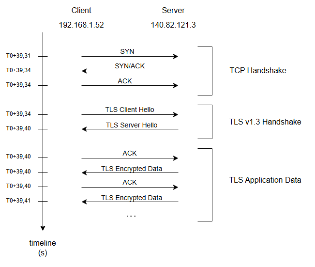
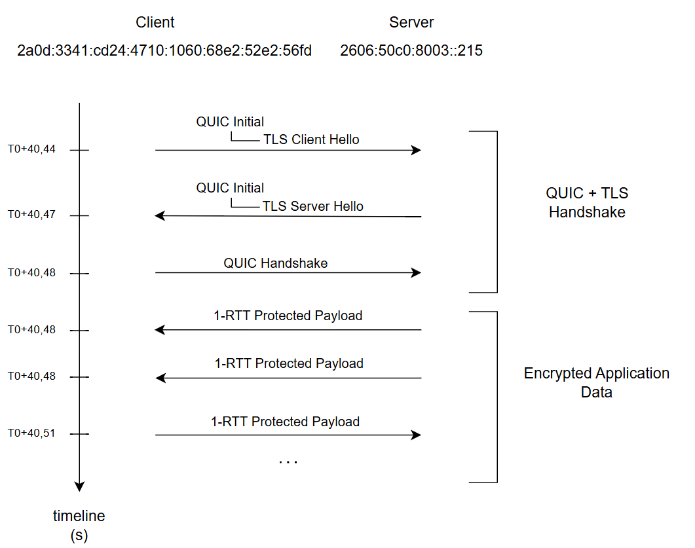

# Network Traffic Analysis: Investigating GitHub Web Traffic with Wireshark

This project presents a network traffic analysis of a browser session loading GitHub using Wireshark. The analysis follows the traffic from local network discovery and DNS resolution to TCP/TLS and QUIC connections, with a focus on understanding the protocols, connection establishment, and observable network metadata.

## Lab environment & Capture Methodology

Environment:
- **Host:** Windows
- **Browser:** Brave
- **Traffic capture:** Wireshark
- **Target:** `github.com`

The browser is opened before the capture starts. The capture is started, and approximately 30 seconds of background traffic are captured before loading the GitHub page. Once the page is fully loaded, wait a few seconds before ending the capture.

## Network Analysis

### Methodology

- Inspect local network traffic and identify Ethernet, ARP, IPv4/IPv6 and ICMPv6 activity.
- Analyze DNS queries and responses to identify github-related domains and their resolved IPv4 and IPv6 addresses.
- Pivot from DNS results to the corresponding IP traffic using IPv4 or IPv6 filters.
- Follow the TCP/TLS flow to analyze the TCP handshake, TLS negotiation and encrypted data transfer.
- Follow the QUIC/TLS traffic to analyze the QUIC connection establishment, TLS negotiation and protected data transfer.
- Correlate packet sequences and timestamps to reconstruct the observed connection flows.

## Key findings

Multiple domains are resolved, for this analysis we will focus on the traffic concerning two of them: `github.com` and `github.githubassets.com`.

The following diagrams summarize the two main connection patterns observed in the capture. First the connection concerning `github.com`:

And the connection concerning `github.githubassets.com`:

The main characteristics of the two connections are compared below.
||Connection 1 |Connection 2 |
|-|-|-|
|Domain|github.com|github.githubassets.com
|IP|	IPv4|	IPv6
|Transport|	TCP	|UDP
|Port|	443|	443
|Security	|TLS 1.3	|TLS 1.3
|Application|	HTTP/2|	HTTP/3
|ALPN|	h2|	h3
|Transport handshake|	TCP 3-way handshake	|QUIC Initial/Handshake

## Project Content

The network overview analysis is available here:
- [Network overview](./analysis/01-network-context.md)

The detailed analysis of both flows is available here:
- [Connection 1 - TCP/TLS](./analysis/02-detailed-analysis-tcp-tls.md)
- [Connection 2 - QUIC](./analysis/03-detailed-analysis-quic.md)

## Limitations and further investigation

The HTTP/2 and HTTP/3 application data is encrypted. The actual HTTP requests and responses cannot be inspected. Without the corresponding session secrets, Wireshark cannot decrypt the TLS/QUIC-protected application data or the encrypted QUIC frames.

The capture could be reproduced while collecting the TLS session secrets. Loading these secrets into Wireshark can allow supported TLS and QUIC traffic to be decrypted, making protocols such as HTTP/2 and HTTP/3 visible.

## Skills Demonstrated
- Packet analysis
- DNS analysis
- TCP analysis
- TLS analysis
- QUIC/HTTP/3 analysis
- Wireshark filtering
- Network traffic investigation