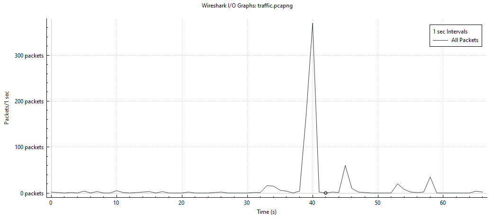
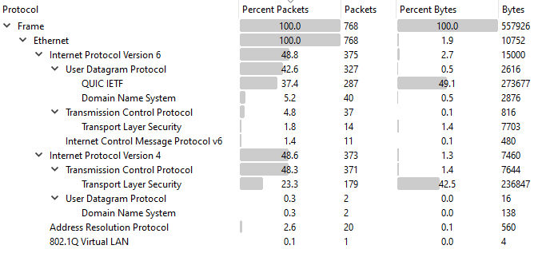
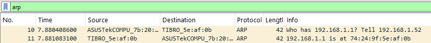

## Timeline

The wireshark diagram clearly shows three main phases:
- from 0s to 38s, the capture mainly contains background traffic
- from 38s to 41s, the activity can be associated with the loading of the github.com page 
- from 41s to 65s, the capture returns to background traffic, with three smaller spikes whose origin cannot be conclusively determined from the timeline alone.

## Protocols overview

Wireshark enables us to view the hierarchy of the packets present in the capture: we can see both IPv4 and IPv6, UDP and TCP, TLS and QUIC. All of these protocols will be detailed with the analysis of the concerned flows.

We can link the encountered protocols with the TCP/IP model:

|TCP/IP Layer|Protocol|Content
|-|-|-
|Application|HTTP/2, HTTP/3| Application Data
|Security | TLS 1.3| Client Hello, Server Hello, Extensions,  Application Data
|Transport|TCP, UDP, QUIC| TCP flags, Sequence Number, Acknowledgment Number, Source and destination port
|Internet|IPv4, IPv6, ICMPv6|Source IP, destination IP, TTL
|Link|Ethernet, ARP|MAC addresses, EtherType

TLS is not a separate layer in the TCP/IP model. It is shown separately here because it provides security between the application and transport layers. QUIC is also shown at the transport level for simplicity, although it combines transport and cryptographic functionality and runs over UDP.

## Ethernet

Each packet frame contains an Ethernet layer, with the main information being source and destination MAC addresses, and the EtherType. For example:
- Source MAC: `74:24:9f:5e:af:0b`
- Destination MAC: `04:d9:f5:7b:20:b5`
- EtherType: IPv4

## ARP

ARP (Address Resolution Protocol) is used to resolve an IPv4 address to a MAC address on a local network.
In this case, we can see that the gateway IPv4 is 192.168.1.1 and MAC address is 74:24:9f:5e:af:0b.
And the local machine IPv4 is 192.168.1.52 and MAC address is 04:d9:f5:7b:20:b5.

## ICMPv6

IPv6 Neighbor Discovery uses ICMPv6 messages to discover neighboring devices and resolve IPv6 addresses to MAC addresses on the local network. In this case we can analyze the ICMPv6 packets and we observe that the IPv6 associated to the MAC address `04:d9:f5:7b:20:b5` is `2a0d:3341:cd24:4710:1060:68e2:52e2:56fd`. When correlating this information with the ARP information above, we see that this is the IPv6 of the local machine.

## Internet Protocol

The Internet Protocol Layer contains important information including:
- Source address: 140.82.121.3
- Destination address: 192.168.1.52
- Time to live: 49 (for IPv4), or Hop Limit for IPv6
- Protocol: TCP (6)
- Total Length: 1476 bytes