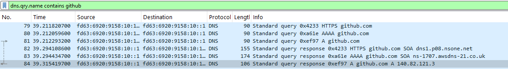
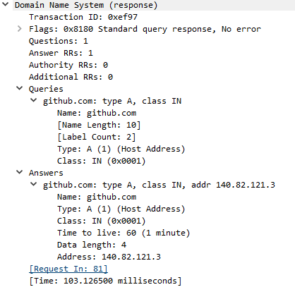
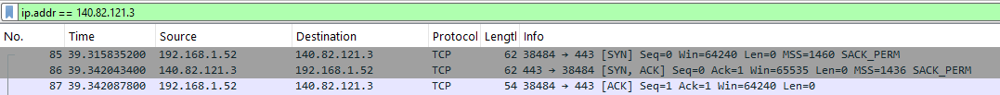
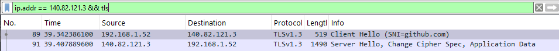
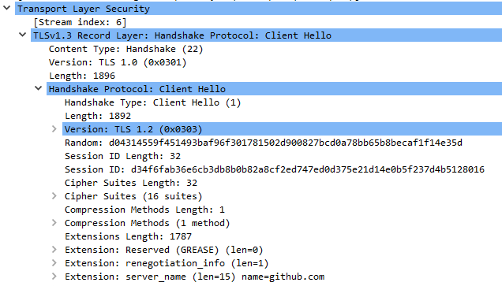
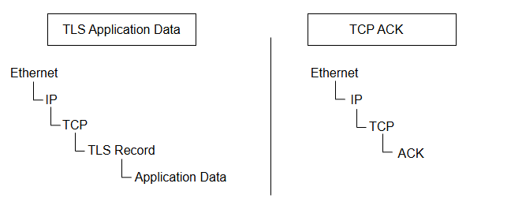

## DNS

First of all we need to find DNS queries and answers related to Github traffic, using the filter `dns.qry.name contains github`.

We focus first on the domain `github.com`. 

Three DNS queries are sent, using the HTTPS, A, and AAAA record types.
- The HTTPS query requests an HTTPS service record. An HTTPS record can provide service parameters such as the supported ALPN protocols and port, as well as other connection hints. In this response, no HTTPS record is present in the Answer section. The Authority section contains information about the authoritative DNS infrastructure.
- The AAAA query looks for the IPv6 addresses of the domain. In this case no AAAA record is present in the Answer section. The Authority section provides authoritative DNS server information.
- The A query looks for the IPv4 addresses of the domain. The Response Answers section shows the IPv4 `140.82.121.3`.

Important fields of a DNS query include, in Queries section:
- Name : github.com
- Type : A, AAAA, HTTPS

And in Answers section, the field Address.

## TCP Handshake

Now that we have identified the IPv4 address associated with the domain, we can filter on that address to view the following activity: `ip.addr == 140.82.121.3`

The first thing we see is the TCP three-way handshake between the Client and the Server:

- SYN from 192.168.1.52 to 140.82.121.3 (source port 38484, destination port 443)
- SYN/ACK from 140.82.121.3 to 192.168.1.52 (source port 443, destination port 38484)
- ACK from 192.168.1.52 to 140.82.121.3 (source port 38484, destination port 443)

This allows the connection establishment, but it does not encrypt any data.
Fields that are interesting to analyze are the following:
- Source Port and Destination Port to identify the flow
- Sequence number: identifies the position of bytes within the TCP stream and can be used to detect retransmissions, missing segments, or disordered delivery
- Flags
- ACK number: indicates the next byte expected by the receiver, acknowledges all previously received bytes
- Window: indicates how much additional data the receiver is currently willing to accept.
- Payload length: amount of data transferred, helps correlating TCP and TLS

## TLS Handshake

After the TCP Handshake we identify the TLS Handshake. The TLS Handshake is used to establish cryptographic parameters. The TLS records involved in the handshake are shown below:

### Client Hello

The Client Hello is a TLS Handshake message sent from the Client (source 192.168.1.52:38484) to the Server (destination 140.82.121.3:443) to share the cryptographic and protocol capabilities that the client can use to establish the TLS connection.

Some fields are important to notify:

- Version: `TLS 1.2` (legacy version)
- Random: `d04314559f451493baf96f301781502d900827bcd0a78bb65b8becaf1f14e35d`. This value is not an encryption key. It is a random value used as an input to the TLS key derivation process.
- Cipher Suites: this is a list of cryptographic suites that the client supports. The server will choose a compatible one.
- Extensions:
    - server_name: `name=github.com`. It indicates what server name the client is trying to reach through the SNI (Server Name Indication).
    - supported_groups: indicates what groups are supported for the key exchange
    - key_share: contains the client's key-exchange contribution
    - signature_algorithms: the client indicates what algorithm signatures are supported
    - supported_versions: lists the TLS versions supported by the client
    - application_layer_protocol_negotiation: ALPN advertises the application protocols supported by the client, such as h2 for HTTP/2 and h3 for HTTP/3.

### Server Hello

The Server Hello is the next TLS Handshake message sent from the Server (source 140.82.121.3:443) to the Client (destination 192.168.1.52:38484). It contains the compatible information chosen by the server to establish the connection.

Some chosen values are:
- Version:  `TLS 1.2` (legacy version)
- Cipher Suite: `TLS_AES_128_GCM_SHA256 (0x1301)`
- Random: `eef3a7d0d710339926ec2ef07cf5a81f946a57167c93991aa187fe059e7f052d`
- Extensions:
    - supported_versions: selected TLS version (TLS 1.3)

### Packets after Server Hello

Right after the Server Hello message is a Change Cipher Spec record. This is a TLS compatibility mechanism.
A TCP packet with the flags PSH and ACK is also sent from the Client right after the handshake. PSH is a TCP flag associated with delivery of buffered data to the receiving application.

## Application Data transfer

Once the handshake is complete, the Application Data transfer starts. It consists of a succession of TLS Application data records, containing encrypted data sent from the server to the client, and TCP ACK packets to acknowledge the data reception. The hierarchy is as follows:

The ACK number is an important piece of information during the data transfer, since it allows us to check whether data was lost. The sequence numbers shown by Wireshark are relative sequence numbers.

Here is an example of the calculation of the ACK Number, using the TLS record number 105 and the TCP ACK packet number 106.

First we investigate the TLS record 105: 
    - sequence number = 4756
    - TCP payload length = 1436 bytes 
This means that the segment transfers 1436 bytes from the sequence number 4756.

In the 106 TCP ACK packet, the ACK number should be the sum of the length of the data received and the sequence number: `ACK = 4756 + 1436 = 6192`.
This means that the client received data until the byte number 6191 and is waiting for the number 6192.

