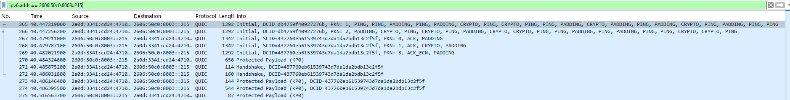
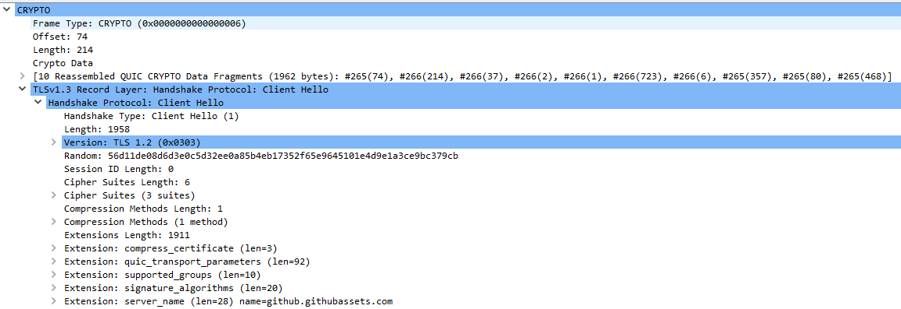
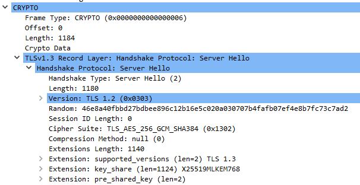
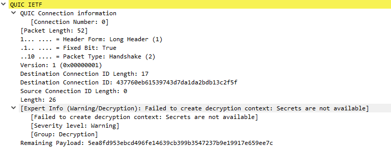
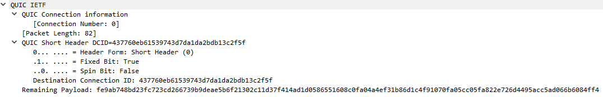

## DNS

First of all we need to find DNS queries and answers related to github.githubassets.com traffic, using the filter `dns.qry.name contains github.githubassets.com`.

Three DNS queries are sent with HTTPS, AAAA and A record types. The results are as follows:
- type A: 185.199.109.215
- type AAAA: 
     - 2606:50c0:8000::215
     - 2606:50c0:8001::215
     - 2606:50c0:8002::215
     - 2606:50c0:8003::215
- type HTTPS: no HTTPS record is present in the Answer section

To identify the corresponding traffic, we pivot from the DNS results to the resolved IP addresses. To determine which IP address is actually used, we need to search traffic concerning each IP from the DNS results.

- `ip.addr == 185.199.109.215` has no results
- `ipv6.addr == 2606:50c0:8000::215` has no results 
- `ipv6.addr == 2606:50c0:8001::215` has no results
- `ipv6.addr == 2606:50c0:8002::215` has no results
- `ipv6.addr == 2606:50c0:8003::215` shows QUIC activity

## QUIC

Based on the previous result, we can filter with `ipv6.addr == 2606:50c0:8003::215` to view the QUIC activity. 

Concerning the protocol hierarchy, QUIC is based on UDP which is based on IPv6. The UDP protocol does not ensure the complete data transfer or the order of the data transfer. 
Compared to UDP, QUIC adds many features such as packet numbers, acknowledgements, loss recovery, streams, and TLS integrated encryption.

Here is a screenshot of the first QUIC packets from the Wireshark capture:

The ports used for the flow are specified in the UDP layer. For a packet sent from the client to the server, the source port is 51928 and the destination port is 443.

QUIC uses DCID (Destination Connection ID) and SCID (Source Connection ID) to identify and route packets belonging to a QUIC connection. For a packet sent from the client to the server the SCID is the connection ID chosen by the client, while the DCID identifies the connection ID used by the server for that connection. QUIC connection IDs allow a connection to persist across changes in the client's network path.
In this case:
- Client ID: db4759f40927276b
- Server ID: 437760eb61539743d7da1da2bdb13c2f5f

### QUIC Initial packets

QUIC uses TLS 1.3 as a cryptographic handshake mechanism. TLS provides authentication, cryptographic negotiation and key establishment.

The handshake is included in QUIC Initial packets, in CRYPTO Frames.
To view only the Initial packets, we use the filter: `ipv6.addr == 2606:50c0:8003::215 && quic.long.packet_type == 0`.

#### Client Hello:

The Client Hello message is in the second Initial packet, sent from the client to the server. It is included in a CRYPTO frame, in the TLSv1.3 Record Layer. Some relevant information sent to the server includes:
     - Random: `56d11de08d6d3e0c5d32ee0a85b4eb17352f65e9645101e4d9e1a3ce9bc379cb`
     - Cipher Suites
     - key_share
     - server_name: `github.githubassets.com`
     - signature_algorithms
     - ALPN: `h3`

#### Server Hello:

The Server Hello is in the fourth Initial packet, sent from the server to the client. It is included in a CRYPTO frame, in the TLSv1.3 Record Layer. Some relevant information sent to the client are:
     - Random: `46e8a40fbbd27bdbee896c12b16e5c020a030707b4fafb07ef4e8b7fc73c7ad2`
     - Cipher Suite: `TLS_AES_256_GCM_SHA384`
     - key_share

### QUIC Handshake packets

After the Initial packets, we see Handshake packets. They can be found easily using the filter: `ipv6.addr == 2606:50c0:8003::215 && quic.long.packet_type == 2`.
The Handshake packets carry the TLS handshake messages required to complete the TLS handshake after the ClientHello and ServerHello. Because the TLS session secrets are not available to Wireshark, the encrypted contents of these Handshake packets cannot be investigated.

### Protected Payload

The Application Data is transferred using Protected Payload packets. The QUIC encryption level is 1-RTT. The packets use the QUIC Short Header format, which is used for 1-RTT packets. The payload is in Key Phase 0 (KP0).

To find payload packets we use this filter: `quic.frame_type >= 0x08 && quic.frame_type <= 0x0f`. 
This filter returns no packets in the capture because Wireshark cannot read the encrypted 1-RTT payload without the corresponding QUIC secrets. Therefore, the STREAM frame type is not available and the filter does not return any result.

If the QUIC secrets were available, Wireshark could decrypt the protected payload and make frames such as STREAM frames visible, including the HTTP/3 traffic.

